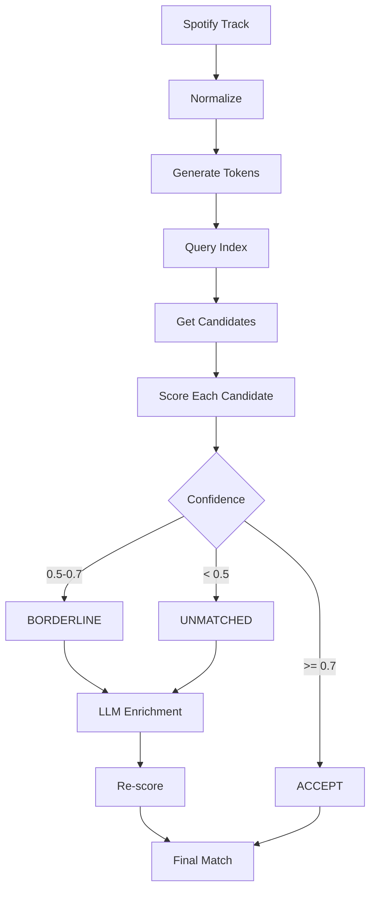
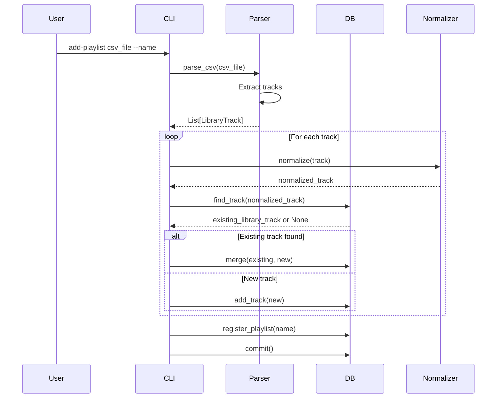
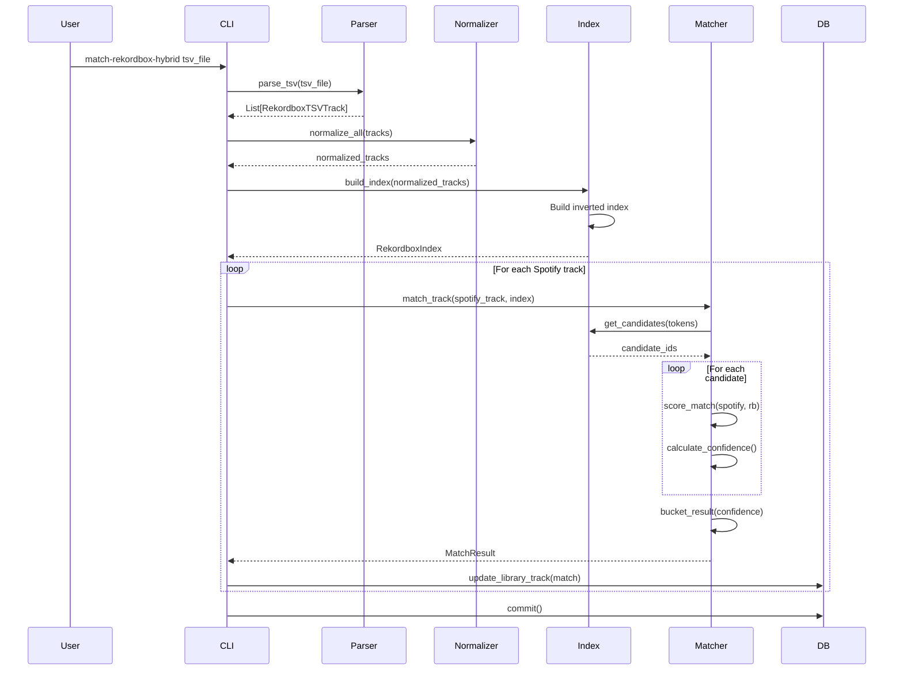

# Music Collection Automation — Technical Approach

> Technical implementation details for the music collection automation system. This document covers database structure, inverted indexes, normalization algorithms, core domain models, and CLI operations. For user requirements, see [`requirements.md`](./requirements.md).

## Core Domain Model

### LibraryTrack Entity

The central entity in the system is a **LibraryTrack**, representing a single piece of music that can exist across multiple contexts (Spotify playlists, Rekordbox collection, downloaded files). All tracks are stored in a unified SQLite database regardless of source.

```python
@dataclass
class LibraryTrack:
    # Core metadata
    title: str
    artist: str
    album: str | None = None
    duration_ms: int | None = None
    
    # Spotify source
    spotify_id: str | None = None
    spotify_url: str | None = None
    playlists: list[str] = field(default_factory=list)
    
    # Rekordbox source
    in_rekordbox: bool = False
    rekordbox_file_path: str | None = None
    rekordbox_bpm: float | None = None
    rekordbox_genre: str | None = None
    rekordbox_key: str | None = None
    rekordbox_match_confidence: float | None = None  # 0.0-1.0
    
    # Purchase links
    amazon_url: str | None = None
    amazon_search_url: str | None = None
    amazon_price: str | None = None
    amazon_last_searched: str | None = None
    
    # Download status
    downloaded: bool = False
    download_path: str | None = None
    download_date: str | None = None
    
    # System fields
    last_updated: str | None = None
    id: str | None = None  # Generated: spotify_{spotify_id} or MD5 hash
```

### RekordboxTSVTrack (Temporary Parsing Entity)

**Note:** `RekordboxTSVTrack` is a temporary data structure used only during TSV parsing and index construction. It is **not** stored in the database. After matching, Rekordbox data is merged into `LibraryTrack` entities.

Used for:
- Parsing Rekordbox TSV export files
- Building inverted index for fast candidate generation
- Temporary representation during matching operations

```python
@dataclass
class RekordboxTSVTrack:
    # Raw fields from TSV
    title: str
    artist: str
    album: str | None
    genre: str | None
    bpm: float | None
    key: str | None
    duration_ms: int | None  # Converted from MM:SS
    file_path: str
    
    # Normalized/computed fields (for indexing only)
    base_title: str  # Title with junk tokens removed
    full_title: str  # Fully normalized title
    artist_tokens: list[str]  # Split artist names (feat, &, ,)
    all_tokens: list[str]  # Combined title + artist tokens
    
    # Internal ID for indexing (temporary)
    rb_track_id: str  # Generated unique ID
```

**After Matching:**
- Matched Rekordbox tracks → Update existing `LibraryTrack` with `in_rekordbox=True`, `rekordbox_file_path`, `rekordbox_bpm`, etc.
- Unmatched Rekordbox tracks → Optionally create new `LibraryTrack` entities (not required)
- `RekordboxTSVTrack` objects are discarded after matching completes

## Database Structure

### SQLite Database Schema

The database is stored as a SQLite database file (`music.db`) with the following schema:

```sql
CREATE TABLE tracks (
    id TEXT PRIMARY KEY,
    title TEXT NOT NULL,
    artist TEXT NOT NULL,
    album TEXT,
    duration_ms INTEGER,
    
    -- Spotify source
    spotify_id TEXT,
    spotify_url TEXT,
    playlists TEXT,  -- JSON array stored as text
    
    -- Rekordbox source
    in_rekordbox BOOLEAN DEFAULT 0,
    rekordbox_file_path TEXT,
    rekordbox_bpm REAL,
    rekordbox_genre TEXT,
    rekordbox_key TEXT,
    rekordbox_match_confidence REAL,
    
    -- Purchase links
    amazon_url TEXT,
    amazon_search_url TEXT,
    amazon_price TEXT,
    amazon_last_searched TEXT,
    
    -- Download status
    downloaded BOOLEAN DEFAULT 0,
    download_path TEXT,
    download_date TEXT,
    
    -- System fields
    last_updated TEXT NOT NULL
);

CREATE TABLE playlists (
    name TEXT PRIMARY KEY,
    source TEXT,
    csv_file TEXT,
    last_imported TEXT
);

-- Indexes for common queries
CREATE INDEX idx_tracks_spotify_id ON tracks(spotify_id);
CREATE INDEX idx_tracks_in_rekordbox ON tracks(in_rekordbox);
CREATE INDEX idx_tracks_downloaded ON tracks(downloaded);
CREATE INDEX idx_tracks_amazon_url ON tracks(amazon_url) WHERE amazon_url IS NOT NULL;
CREATE INDEX idx_tracks_rekordbox_file_path ON tracks(rekordbox_file_path) WHERE rekordbox_file_path IS NOT NULL;
```

### Database Operations

**Connection:**
- Opens SQLite connection to `music.db`
- Creates tables and indexes if they don't exist
- Uses connection pooling for concurrent access

**CRUD Operations:**
- `add_track(track: LibraryTrack)` - Insert or update track (UPSERT)
- `get_track(track_id)` - Get track by ID
- `find_track(track: LibraryTrack, threshold)` - Fuzzy match search (uses SQL + Python filtering)
- `update_track(track_id, updates)` - Update specific fields

**Query Operations:**
- `get_tracks_without_amazon_links()` - `SELECT * FROM tracks WHERE amazon_url IS NULL`
- `get_missing_tracks()` - `SELECT * FROM tracks WHERE downloaded = 0 AND in_rekordbox = 0`
- `get_tracks_in_rekordbox()` - `SELECT * FROM tracks WHERE in_rekordbox = 1`
- `get_tracks_by_playlist(playlist_name)` - Filter by playlist JSON array

**Benefits:**
- Fast indexed queries (no full table scans)
- Atomic transactions for bulk operations
- Concurrent read access
- Smaller file size than JSON
- Standard SQL tooling for inspection

## CLI Operations

> **⚠️ DRAFT - Subject to Approval at Implementation Time**
>
> The CLI command structure below is proposed and may change during implementation. Commands are documented here for planning purposes.

### Command Structure

All operations use the `mm` command-line tool:

```bash
mm <command> [subcommand] [options]
```

### 1. Import Rekordbox Collection

**Command:** `mm import-rekordbox`

**Usage:**
```bash
mm import-rekordbox rekordbox/all-tracks.txt
```

**Behavior:**
- Parses Rekordbox TSV export file
- Builds inverted index for matching
- Matches against existing `LibraryTrack` entities in database
- Updates matched tracks with Rekordbox metadata:
  - `in_rekordbox = true`
  - `rekordbox_file_path`
  - `rekordbox_bpm`, `rekordbox_genre`, `rekordbox_key`
  - `rekordbox_match_confidence`
- Optionally adds unmatched Rekordbox tracks as new `LibraryTrack` entities
- Commits transaction

**Options:**
- `--add-unmatched`: Add Rekordbox-only tracks to database (default: false)
- `--min-confidence <float>`: Minimum confidence to update (default: 0.6)

### 2. Import Spotify Playlist

**Command:** `mm import-spotify`

**Usage:**
```bash
mm import-spotify playlists/koko-groove.csv --name "Koko Groove"
```

**Behavior:**
- Parses CSV file exported from chosic.com
- For each track:
  - Checks for existing `LibraryTrack` (by Spotify ID or fuzzy match)
  - If exists: merges playlists, updates metadata
  - If new: creates `LibraryTrack` entity
- Registers playlist in `playlists` table
- Commits transaction

**CSV Format:**
- Columns: `Song`, `Artist`, `Album`, `Duration`, `Spotify Track Id`
- Duration format: `MM:SS` (converted to milliseconds)

**Deduplication:**
- Exact match by Spotify ID (if available)
- Fuzzy matching on artist + title (threshold: 85% similarity)

### 3. Fetch Amazon Link for Track

**Command:** `mm fetch-amazon-link`

**Usage:**
```bash
mm fetch-amazon-link <trackId>
```

**Behavior:**
- Finds track by ID in database
- Searches Amazon Music via DuckDuckGo
- Updates `LibraryTrack` with:
  - `amazon_url` (if product found)
  - `amazon_search_url`
  - `amazon_price` (if available)
  - `amazon_last_searched` timestamp
- Commits transaction

**Search Strategy:**
- Prioritizes track/album URLs over artist pages
- Multiple query patterns attempted
- Falls back to direct Amazon scraping if DuckDuckGo fails

### 4. Fetch Amazon Links for Missing Tracks

**Command:** `mm fetch-missing-amazon-links`

**Usage:**
```bash
mm fetch-missing-amazon-links
```

**Behavior:**
- Finds all tracks where:
  - `downloaded = false` AND
  - `in_rekordbox = false` AND
  - `amazon_url IS NULL`
- For each track: calls `fetch-amazon-link` logic
- Rate limiting: 2 second delay between requests
- Commits transaction periodically (every 10 tracks)

### 5. List/Search Tracks

**Command:** `mm tracks list`

**Usage:**
```bash
# List missing tracks
mm tracks list --missing

# Search tracks (matches across artist and title)
mm tracks list --search "octave untold"

# List with filters
mm tracks list --playlist "Koko Groove" --missing
mm tracks list --artist "Octave One"
mm tracks list --in-rekordbox --genre "Techno"

# Custom fields
mm tracks list --missing --fields title,artist,amazon_url,amazon_price

# Output formats
mm tracks list --missing --format json
mm tracks list --missing --format csv > missing.csv
mm tracks list --missing --count
```

**Filter Options:**
- `--search <query>`: Search across artist and title fields (fuzzy match, space-separated tokens)
- `--missing`: `downloaded=false AND in_rekordbox=false`
- `--in-rekordbox`: `in_rekordbox=true`
- `--downloaded`: `downloaded=true`
- `--no-amazon-link`: `amazon_url IS NULL`
- `--from-spotify`: `spotify_id IS NOT NULL`
- `--from-rekordbox`: `rekordbox_file_path IS NOT NULL`
- `--playlist <name>`: Filter by playlist name
- `--artist <name>`: Filter by artist (fuzzy match)
- `--title <name>`: Filter by title (fuzzy match)
- `--genre <name>`: Filter by genre

**Field Selection:**
- `--fields <comma-separated>`: Specify fields to return
- `--all`: Return all fields
- `--extended`: Return essential + metadata fields

**Output Options:**
- `--format <table|json|csv>`: Output format (default: table)
- `--count`: Return count only
- `--sort <field>`: Sort by field (artist, title, confidence, etc.)

**Default Fields:**
- `id`, `title`, `artist`, `amazon_url`, `in_rekordbox`, `downloaded`

**Extended Fields:**
- Adds: `album`, `duration_ms`, `rekordbox_bpm`, `rekordbox_genre`, `playlists`, `spotify_url`

## Usage Examples

> **⚠️ DRAFT - Subject to Approval at Implementation Time**

### Import Rekordbox collection
```bash
mm import-rekordbox rekordbox/all-tracks.txt --min-confidence 0.6
```

### Import Spotify playlist
```bash
mm import-spotify playlists/koko-groove.csv --name "Koko Groove"
```

### Fetch Amazon link for specific track
```bash
mm fetch-amazon-link spotify_0sQDaCCZDNsdSBnP66Z8BN
```

### Fetch Amazon links for all missing tracks
```bash
mm fetch-missing-amazon-links
```

### List missing tracks
```bash
mm tracks list --missing
```

### Search tracks
```bash
mm tracks list --search "octave untold"
mm tracks list --search "yuksek" --missing
```

### List tracks with filters and custom output
```bash
mm tracks list --playlist "Koko Groove" --missing --format json
mm tracks list --in-rekordbox --genre "Techno" --fields title,artist,rekordbox_bpm
```

## File Structure

```
music/
├── music.db                      # SQLite database file
├── playlists/
│   └── *.csv                     # Spotify playlist CSV exports
├── rekordbox/
│   └── all-tracks.txt            # Rekordbox TSV export
├── src/
│   ├── mm.py                     # Main CLI tool (new)
│   ├── library_db.py             # SQLite database management (new)
│   ├── rekordbox_tsv_parser.py   # Rekordbox TSV parser
│   ├── rekordbox_index.py        # Inverted index for matching
│   ├── track_normalizer.py       # Text normalization utilities
│   ├── amazon_music.py           # Amazon Music search
│   ├── download_scanner.py       # File system scanner
│   └── [legacy v1 files]         # track_db.py, etc. (deprecated draft/v1)
└── docs/
    ├── requirements.md           # Functional requirements
    ├── tech-approach.md          # Technical approach (this file)
    └── tickets/                  # Implementation tickets
```

## Design Principles

1. **SQLite Database**: Single file, indexed queries, atomic transactions, easy backup
2. **Unified Track Model**: All tracks stored as `LibraryTrack` regardless of source
3. **Deduplication**: Automatic merging of duplicate tracks from multiple playlists
4. **Fuzzy Matching**: Handles variations in track metadata across sources
5. **Non-Destructive Updates**: Only updates fields that are missing or need updating
6. **Graceful Degradation**: Falls back to search URLs if direct product links unavailable
7. **Rate Limiting**: Built-in delays to avoid overwhelming external services
8. **Transaction Safety**: SQLite transactions ensure data consistency

## Normalization System

### Text Normalization Pipeline

Normalization is critical for accurate matching given metadata inconsistencies. The pipeline processes text through multiple stages:

```python
def normalize_text(text: str) -> str:
    """Base normalization: lowercase, strip punctuation, collapse whitespace."""
    # 1. Lowercase
    text = text.lower()
    # 2. Remove punctuation (keep alphanumeric and spaces)
    text = re.sub(r'[^\w\s]', ' ', text)
    # 3. Collapse whitespace
    text = re.sub(r'\s+', ' ', text)
    # 4. Strip
    return text.strip()

def standardize_feat_tokens(text: str) -> str:
    """Normalize feat/ft/featuring variations."""
    # Replace all variations with "feat"
    text = re.sub(r'\b(feat|ft|featuring)\b', 'feat', text, flags=re.IGNORECASE)
    return text

def standardize_separators(text: str) -> str:
    """Normalize &/and/, separators."""
    # Replace & and , with "and"
    text = re.sub(r'\s*&\s*', ' and ', text)
    text = re.sub(r'\s*,\s*', ' and ', text)
    return text

def remove_junk_tokens(text: str) -> str:
    """Remove common junk tokens from titles."""
    junk_patterns = [
        r'\boriginal mix\b',
        r'\bextended\b',
        r'\bradio edit\b',
        r'\bedit\b',
        r'\bmix\b',
        r'\bremix\b',
        r'\bversion\b',
    ]
    for pattern in junk_patterns:
        text = re.sub(pattern, '', text, flags=re.IGNORECASE)
    return normalize_text(text)  # Re-normalize after removal

def remove_label_tokens(text: str) -> str:
    """Remove catalog codes like KR006, [A-Z]{2,}\d+."""
    # Remove catalog codes (2+ uppercase letters followed by digits)
    text = re.sub(r'\b[A-Z]{2,}\d+\b', '', text)
    return normalize_text(text)
```

### Derived Fields

**Base Title:**
- Title with junk tokens and label codes removed
- Used for matching (ignores remix/edit variations)

**Full Title:**
- Fully normalized title (all normalization steps applied)
- Used for exact matching

**Artist Tokens:**
- Split artist string on feat/&/,
- Each token normalized individually
- Enables matching when artist names are formatted differently

**All Tokens:**
- Combined tokens from base_title + artist_tokens
- Used for inverted index

### Normalization Example

**Input:**
- Title: "Showbiz Feat. Villa (Purple Disco Machine Edit)"
- Artist: "Yuksek"

**Normalized:**
- `base_title`: "showbiz feat villa purple disco machine"
- `full_title`: "showbiz feat villa purple disco machine"
- `artist_tokens`: ["yuksek"]
- `all_tokens`: ["showbiz", "feat", "villa", "purple", "disco", "machine", "yuksek"]

## Inverted Index Design

### Index Structure

The inverted index enables fast candidate generation by mapping tokens to track IDs:

```python
class RekordboxIndex:
    def __init__(self, tracks: list[RekordboxTSVTrack]):
        # Inverted index: token -> set[rb_track_id]
        self.token_index: dict[str, set[str]] = {}
        
        # Forward index: rb_track_id -> RekordboxTSVTrack
        self.tracks: dict[str, RekordboxTSVTrack] = {}
        
        # Token frequency: token -> count (for rare token filtering)
        self.token_frequency: dict[str, int] = {}
        
        # Total tracks (for frequency calculations)
        self.total_tracks: int = len(tracks)
```

### Index Construction Algorithm

```python
def build_index(self, tracks: list[RekordboxTSVTrack], rare_token_threshold: float = 0.05):
    """
    Build inverted index from Rekordbox tracks.
    
    Args:
        tracks: List of Rekordbox tracks to index
        rare_token_threshold: Only index tokens appearing in < threshold% of tracks
    """
    # Step 1: Count token frequencies
    for track in tracks:
        for token in track.all_tokens:
            self.token_frequency[token] = self.token_frequency.get(token, 0) + 1
    
    # Step 2: Build index with rare tokens only
    max_frequency = int(self.total_tracks * rare_token_threshold)
    
    for track in tracks:
        self.tracks[track.rb_track_id] = track
        
        for token in track.all_tokens:
            # Only index rare tokens (exclude stopwords and common tokens)
            if (self.token_frequency[token] <= max_frequency and 
                token not in STOPWORDS):
                if token not in self.token_index:
                    self.token_index[token] = set()
                self.token_index[token].add(track.rb_track_id)
```

### Stopwords

Common tokens excluded from index (too frequent to be useful):

```python
STOPWORDS = {
    'track', 'mix', 'original', 'edit', 'remix', 'version', 
    'extended', 'radio', 'the', 'a', 'an', 'and', 'or', 'but',
    'feat', 'ft', 'featuring'  # Separators, not content
}
```

### Candidate Generation Algorithm

```python
def get_candidates(
    self, 
    spotify_tokens: list[str], 
    max_candidates: int = 100
) -> list[str]:
    """
    Generate candidate Rekordbox track IDs from Spotify track tokens.
    
    Args:
        spotify_tokens: Normalized tokens from Spotify track
        max_candidates: Maximum number of candidates to return
    
    Returns:
        List of rb_track_id sorted by token overlap count
    """
    # Step 1: Union candidate sets from token index
    candidate_scores: dict[str, int] = {}  # rb_track_id -> overlap count
    
    for token in spotify_tokens:
        if token in self.token_index:
            for rb_track_id in self.token_index[token]:
                candidate_scores[rb_track_id] = candidate_scores.get(rb_track_id, 0) + 1
    
    # Step 2: Sort by overlap count (descending)
    sorted_candidates = sorted(
        candidate_scores.items(), 
        key=lambda x: x[1], 
        reverse=True
    )
    
    # Step 3: Return top candidates
    return [rb_track_id for rb_track_id, _ in sorted_candidates[:max_candidates]]
```

### Index Performance

**Construction:**
- Time complexity: O(n × m) where n = tracks, m = avg tokens per track
- For 22k tracks with ~10 tokens each: ~220k operations
- Expected time: < 1 second

**Query:**
- Time complexity: O(k × log(c)) where k = query tokens, c = candidates
- For 5 tokens, 100 candidates: ~500 operations
- Expected time: < 10ms per query

## Matching Algorithm

### Hybrid Matching Pipeline



### Deterministic Scoring

**Text Similarity:**

```python
def calculate_text_similarity(
    spotify_track: LibraryTrack,
    rekordbox_track: RekordboxTSVTrack
) -> tuple[float, float]:
    """
    Calculate title and artist similarity scores.
    
    Returns:
        (title_score, artist_score) both 0-100
    """
    # Title similarity (base_title vs base_title)
    title_score = fuzz.token_sort_ratio(
        spotify_track.base_title,
        rekordbox_track.base_title
    )
    
    # Artist similarity (compare with all artist tokens)
    artist_scores = []
    for rb_artist_token in rekordbox_track.artist_tokens:
        score = fuzz.ratio(
            spotify_track.normalize_artist(),
            rb_artist_token
        )
        artist_scores.append(score)
    artist_score = max(artist_scores) if artist_scores else 0.0
    
    # Swap score (handle metadata swaps)
    swap_title_score = fuzz.token_sort_ratio(
        spotify_track.base_title,
        rekordbox_track.normalize_artist()
    )
    swap_artist_score = fuzz.ratio(
        spotify_track.normalize_artist(),
        rekordbox_track.base_title
    )
    swap_score = (swap_title_score + swap_artist_score) / 2
    
    # Use max of normal vs swapped
    title_score = max(title_score, swap_title_score)
    artist_score = max(artist_score, swap_artist_score)
    
    return (title_score, artist_score)
```

**Duration Hint:**

```python
def calculate_duration_hint(
    spotify_ms: int | None,
    rekordbox_ms: int | None
) -> float:
    """
    Calculate duration-based boost/penalty.
    
    Returns:
        Boost value (-0.1 to +0.1)
    """
    if not spotify_ms or not rekordbox_ms:
        return 0.0
    
    delta_seconds = abs(spotify_ms - rekordbox_ms) / 1000.0
    
    if delta_seconds < 10:
        return 0.1  # Strong boost (likely same track)
    elif delta_seconds < 30:
        return 0.05  # Mild boost (different edit, same track)
    elif delta_seconds < 90:
        return 0.0  # Neutral (acceptable variation)
    else:
        return -0.1  # Penalty (likely different track)
```

**Album Hint:**

```python
def calculate_album_hint(
    spotify_album: str | None,
    rekordbox_album: str | None
) -> float:
    """
    Calculate album-based boost.
    
    Returns:
        Boost value (0.0 to 0.05)
    """
    if not spotify_album or not rekordbox_album:
        return 0.0
    
    # Normalize both albums
    spotify_norm = normalize_text(spotify_album)
    rekordbox_norm = normalize_text(rekordbox_album)
    
    # Calculate overlap
    if spotify_norm == rekordbox_norm:
        return 0.05  # Exact match
    elif spotify_norm in rekordbox_norm or rekordbox_norm in spotify_norm:
        return 0.03  # Partial match
    else:
        return 0.0
```

**Combined Confidence Score:**

```python
def calculate_confidence(
    title_score: float,
    artist_score: float,
    duration_hint: float,
    album_hint: float
) -> float:
    """
    Calculate final confidence score (0.0-1.0).
    
    Weights:
    - Title: 70% (most important)
    - Artist: 25%
    - Hints: 5% combined
    """
    base_score = (
        title_score * 0.7 +
        artist_score * 0.25
    ) / 100.0
    
    # Add hints (already normalized)
    confidence = base_score + duration_hint + album_hint
    
    # Clamp to [0, 1]
    return max(0.0, min(1.0, confidence))
```

### Matching Example

**Spotify Track:**
- Title: "Untold"
- Artist: "Octave One"
- Duration: 339000ms

**Rekordbox Track:**
- Title: "Untold"
- Artist: "Octave One"
- Duration: 339000ms
- Album: "Black Water"

**Scoring:**
- Title similarity: 100 (exact match)
- Artist similarity: 100 (exact match)
- Duration hint: +0.1 (exact match)
- Album hint: +0.0 (no Spotify album)
- **Confidence**: (100 × 0.7 + 100 × 0.25) / 100 + 0.1 = **0.95** → ACCEPT

## Data Flow

### Playlist Import Flow



### Rekordbox Matching Flow



## Core Domain Concepts

### LibraryTrack Identity

A track can be identified by:
1. **Spotify ID** (primary) - `spotify_{spotify_id}`
2. **Rekordbox file path hash** (for Rekordbox-only tracks) - MD5 hash of `file_path`
3. **Hash-based ID** (fallback) - MD5 hash of `artist|title`

**ID Generation:**
```python
def generate_track_id(track: LibraryTrack) -> str:
    if track.spotify_id:
        return f"spotify_{track.spotify_id}"
    elif track.rekordbox_file_path:
        key = track.rekordbox_file_path.lower()
        return f"rb_{hashlib.md5(key.encode()).hexdigest()[:16]}"
    else:
        key = f"{track.artist}|{track.title}".lower()
        return hashlib.md5(key.encode()).hexdigest()[:16]
```

**Unified Model:**
- All tracks (Spotify, Rekordbox, or both) are stored as `LibraryTrack` entities
- When matching Rekordbox tracks to Spotify tracks, update existing `LibraryTrack` records
- Rekordbox-only tracks (not in any Spotify playlist) can be added to database
- Filter tracks by flags: `in_rekordbox`, `downloaded`, `playlists`, etc.

### LibraryTrack Matching

Matching operates on multiple levels:

1. **Exact Match** - Same Spotify ID or identical normalized artist+title
2. **Fuzzy Match** - Similar artist+title (85%+ similarity threshold)
3. **Hybrid Match** - Deterministic scoring + LLM assistance for borderline cases

### LibraryTrack States

A track can be in multiple states simultaneously:

- **In Spotify Playlist** - `playlists` array contains playlist names
- **In Rekordbox** - `in_rekordbox = true`, `rekordbox_file_path` set
- **Downloaded** - `downloaded = true`, `download_path` set
- **Has Purchase Link** - `amazon_url` set

**Missing Track Query:**
```sql
SELECT * FROM tracks 
WHERE downloaded = 0 AND in_rekordbox = 0;
```

Or in Python:
```python
missing = db.get_missing_tracks()  # Uses SQL query with indexes
```

### Deduplication Strategy

When importing playlists, tracks are deduplicated:

1. **Exact Match** - Same Spotify ID → merge playlists
2. **Fuzzy Match** - 85%+ similarity → merge playlists, update metadata
3. **New Track** - No match → add to database

**Merge Logic:**
- Playlists: Union of both track's playlists
- Metadata: Prefer non-null values
- Timestamps: Update `last_updated`

## Performance Characteristics

### Database Operations

**Connection:**
- Time: O(1) - SQLite connection is fast
- File size: ~1-2MB for 26k tracks (vs ~10-20MB JSON)

**Query Operations:**
- Indexed queries: O(log n) with indexes
- `get_tracks_in_rekordbox()`: ~10-50ms for 26k tracks (indexed)
- `get_missing_tracks()`: ~10-50ms (indexed boolean fields)
- `find_track()`: O(n) for fuzzy matching (still requires Python filtering)

**Insert/Update:**
- Single track: ~1-5ms (indexed insert)
- Bulk operations: Use transactions for ~1000 tracks/second

**Backup:**
- SQLite backup: `sqlite3 music.db ".backup backup.db"` - fast file copy

### Index Operations

**Construction:**
- Time: O(n × m) where n = tracks, m = avg tokens
- For 22k tracks, ~10 tokens each: ~220k operations
- Expected: < 1 second

**Query:**
- Time: O(k × log(c)) where k = query tokens, c = candidates
- For 5 tokens, 100 candidates: ~500 operations
- Expected: < 10ms per query

### Matching Operations

**Per Track:**
- Candidate generation: ~10ms
- Scoring 100 candidates: ~5 seconds (50ms per candidate)
- Total per track: ~5 seconds

**Full Matching (200 Spotify tracks, 22k Rekordbox):**
- Index construction: ~1 second (one-time)
- Matching: 200 × 5s = ~17 minutes
- Total: ~17-20 minutes (acceptable for one-time operation)

## Future Optimizations

### Database Indexing

SQLite automatically uses indexes for queries:
- `idx_tracks_spotify_id` - Fast Spotify ID lookups
- `idx_tracks_in_rekordbox` - Fast filtering by collection status
- `idx_tracks_downloaded` - Fast download status queries
- `idx_tracks_amazon_url` - Fast Amazon link queries

**Playlist Indexing:**
- Playlists stored as JSON array in `playlists` column
- Use JSON functions: `json_each()` for filtering
- Consider separate `track_playlists` junction table for better performance if needed

### Index Optimizations

- **Token compression**: Store token sets more efficiently
- **Incremental updates**: Update index when Rekordbox collection changes
- **Persistent index**: Save index to disk for reuse

### Matching Optimizations

- **Parallel scoring**: Score multiple candidates concurrently
- **Early termination**: Stop scoring if confidence threshold exceeded
- **Caching**: Cache normalization results for repeated tracks

## Error Handling & Edge Cases

### Malformed Data

- **Invalid CSV rows**: Skip with warning, continue processing
- **Missing TSV columns**: Use defaults (None for optional fields)
- **Invalid durations**: Skip duration hint, continue matching
- **Corrupted SQLite database**: Use `.backup` to restore from backup, or recreate schema

### Matching Edge Cases

- **Metadata swaps**: Handled by swap score calculation
- **Different edits**: Duration hint accounts for variations
- **Missing metadata**: Graceful degradation (skip hints)
- **No candidates**: Return UNMATCHED, trigger LLM assistance

### Index Edge Cases

- **Empty tokens**: Skip indexing, handle in scoring
- **All tokens rare**: Index all tokens (fallback)
- **No candidates**: Return empty list, trigger broader search
